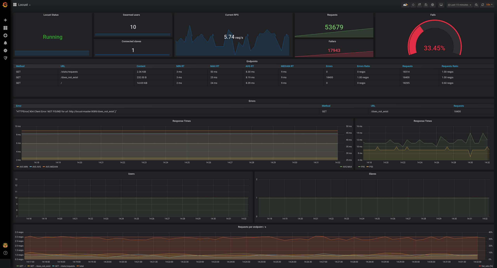
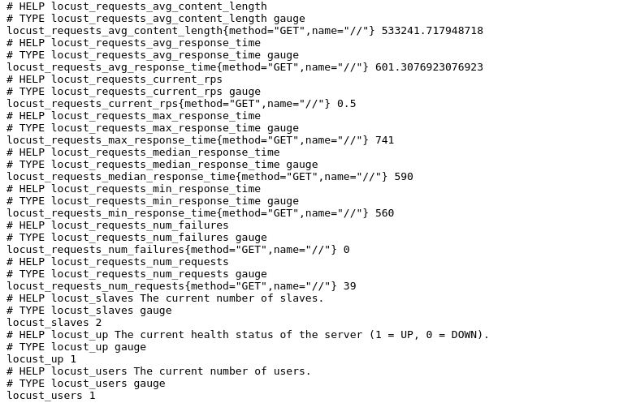

# Locust Exporter

Prometheus exporter for [Locust](https://github.com/locustio/locust). This exporter was inspired by [mbolek/locust_exporter](https://github.com/mbolek/locust_exporter).

[](https://hub.docker.com/r/containersol/locust_exporter/tags) [](https://github.com/ContainerSolutions/locust_exporter/blob/master/LICENSE)



## Quick Start

This package is available for Docker:

1. Run Locust ([example docker-compose](https://github.com/locustio/locust/blob/master/examples/docker-compose/docker-compose.yml))

2. Run Locust Exporter

    with docker:

    ```bash
    docker run --net=host containersol/locust_exporter
    ```

    or with docker-compose:

    ```yaml
    version: "3.0"

    services:
      locust-exporter:
        image: containersol/locust_exporter
        network_mode: "host"
    ```

3. Modify `prometheus.yml` to add target to Prometheus

    ```yaml
    scrape_configs:
      - job_name: 'locust'
        static_configs:
          - targets: ['<LOCUST_IP>:9646']
    ```

4. Add dashboard to Grafana with ID [11985](https://grafana.com/grafana/dashboards/11985)

## Building and Running

The default way to build is:

```bash
go get github.com/ContainerSolutions/locust_exporter
cd ${GOPATH-$HOME/go}/src/github.com/ContainerSolutions/locust_exporter/
go run main.go
```

### Flags

- `--locust.uri`
  Address of Locust. Default is `http://localhost:8089`.

- `--locust.timeout`
  Timeout request to Locust. Default is `5s`.

- `--web.listen-address`
  Address to listen on for web interface and telemetry. Default is `:9646`.

- `--web.telemetry-path`
  Path under which to expose metrics. Default is `/metrics`.

- `--locust.namespace`
  Namespace for prometheus metrics. Default `locust`.

- `--log.level`
  Set logging level: one of `debug`, `info`, `warn`, `error`, `fatal`

- `--log.format`
  Set the log output target and format. e.g. `logger:syslog?appname=bob&local=7` or `logger:stdout?json=true`
  Defaults to `logger:stderr`.

### Environment Variables

The following environment variables configure the exporter:

- `LOCUST_EXPORTER_URI`
  Address of Locust. Default is `http://localhost:8089`.

- `LOCUST_EXPORTER_TIMEOUT`
  Timeout reqeust to Locust. Default is `5s`.

- `LOCUST_EXPORTER_WEB_LISTEN_ADDRESS`
  Address to listen on for web interface and telemetry. Default is `:9646`.

- `LOCUST_EXPORTER_WEB_TELEMETRY_PATH`
  Path under which to expose metrics. Default is `/metrics`.

- `LOCUST_METRIC_NAMESPACE`
  Namespace for prometheus metrics. Default `locust`.

### Grafana

The grafana dashboard has beed published with ID [11985](https://grafana.com/grafana/dashboards/11985) and was exported to [locust_dashboard.json](locust_dashboard.json).

### Screenshot

[](locust_exporter.md)

### Changelog

Please see [CHANGELOG](CHANGELOG.md) for more information on what has changed recently.

## Contributing

Please see [CONTRIBUTING](CONTRIBUTING.md) for details.

## License

Apache License. Please see [License File](LICENSE.md) for more information.
